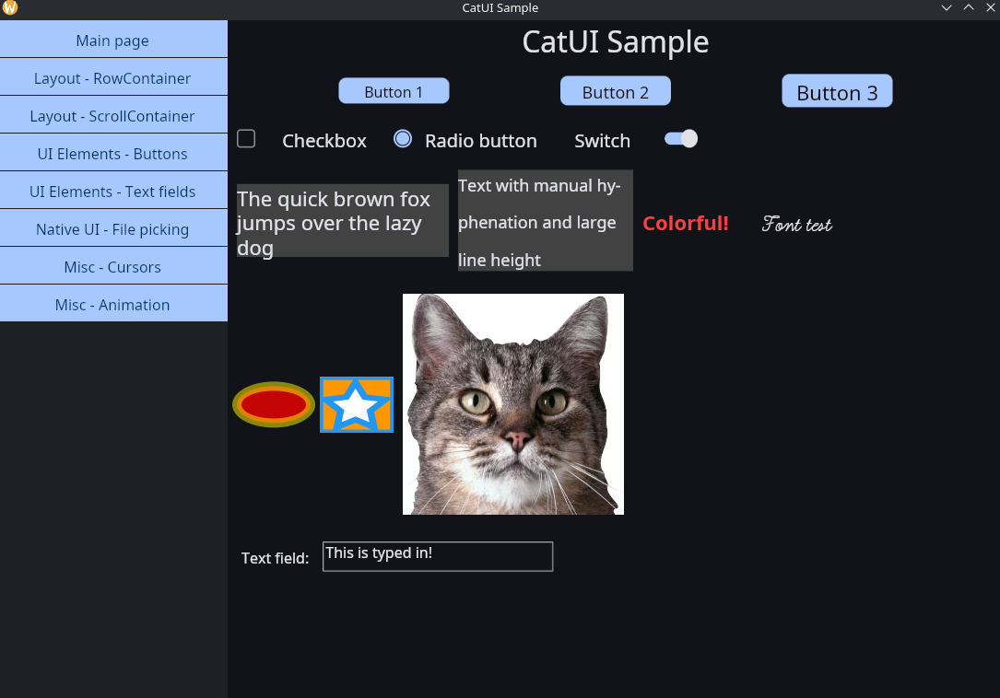
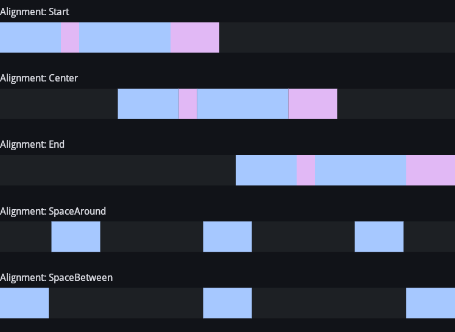
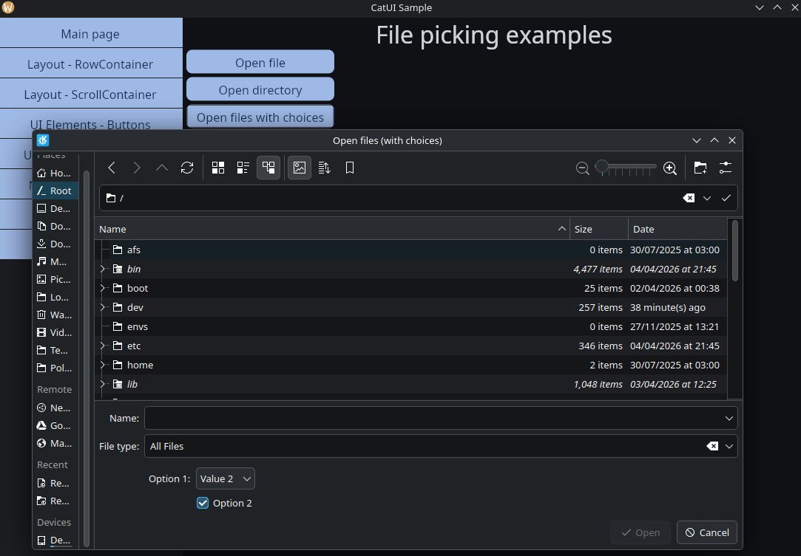

# CatUI

CatUI is a fast, cross-platform and easy-to-use UI framework for .NET. It is decoupled from native platform UI options
and instead uses SkiaSharp for rendering, meaning that the user interface will look exactly the same on all platforms
(Windows, macOS, Linux, and Android). Instead of using markup languages for creating the UI, CatUI follows a modern
approach of creating everything related to UI through C# code.

## Showcase

Below are some screenshots of CatUI in action in the sample application (CatUISample):

Main page

Linear container alignment example

Native integration: file picker
